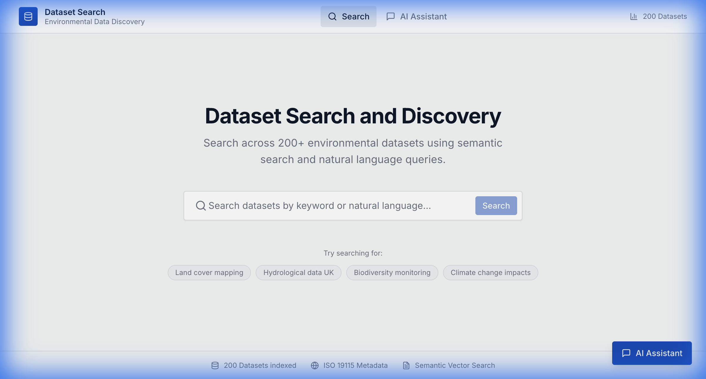
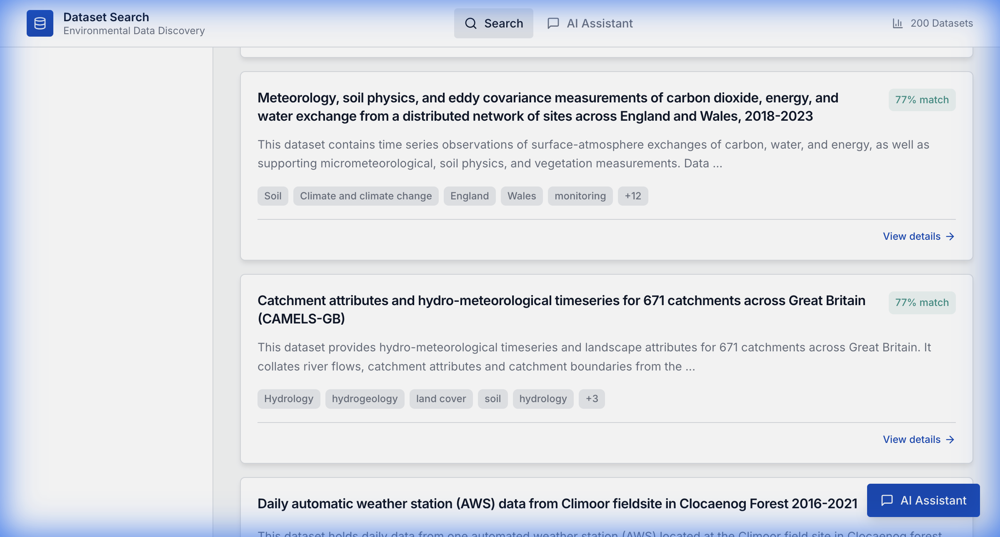
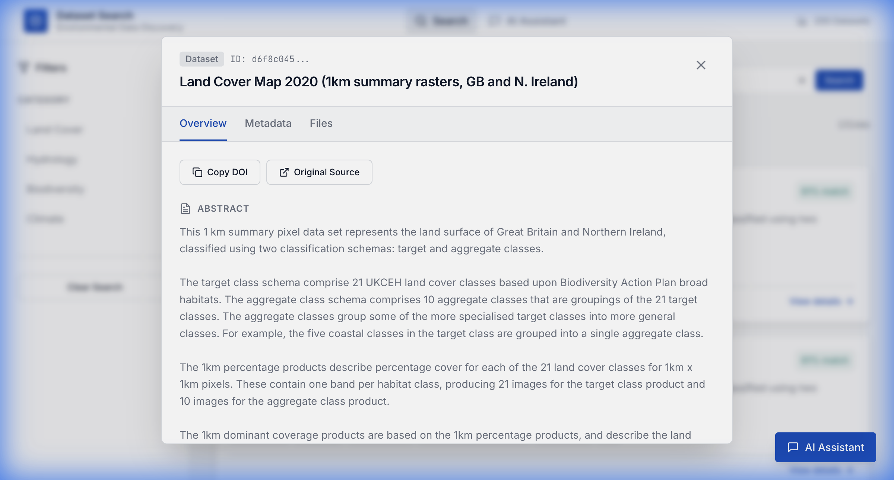
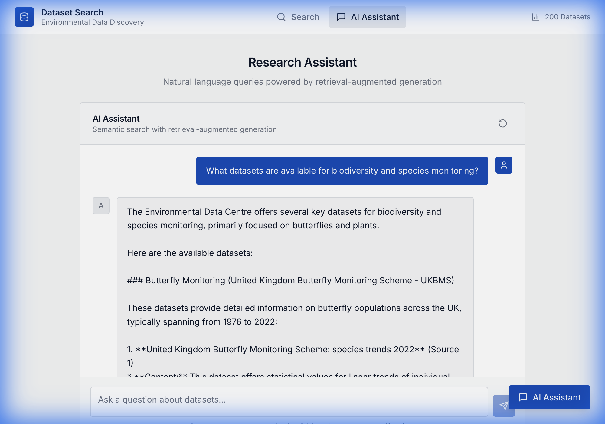
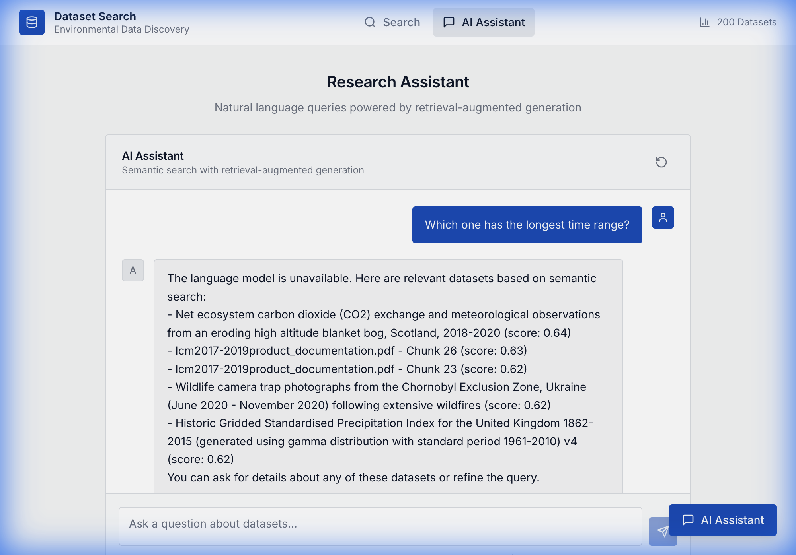

# Dataset Search and Discovery Solution

## University of Manchester - Research Software Engineering Project

A dataset search and discovery platform that ingests ISO 19115 metadata, stores it in SQLite, builds semantic vectors, and exposes search and optional chat through a Svelte web app.

---

## Key Features

### Data Ingestion and ETL
- Metadata extraction for JSON, XML, JSON-LD, and RDF (Turtle)
- Full raw document storage with checksums and source tracking
- Relationship parsing from CEH JSON metadata
- Access-type handling for download and fileAccess datasets
- ZIP download and extraction for dataset files
- FileAccess crawling for web-accessible folders

### Search and Semantic Indexing
- Sentence-transformers embeddings (all-MiniLM-L6-v2, 384 dims)
- ChromaDB persistence for dataset vectors
- Semantic search API with relevance scoring
- Structured fields in SQLite for metadata display and filtering

### Supporting Documents and RAG
- Supporting document discovery via CEH data-package ZIP
- Fallback HTML crawling when ZIP is unavailable
- PDF and DOCX text extraction for document content
- Chunking and embedding of document content for RAG retrieval
- Separate vector collection for supporting document chunks

### Chat and Conversation
- Chat endpoint backed by Gemini (API key required)
- Multi-turn conversation state with per-conversation history
- Source attribution from retrieved datasets and documents
- Conversation management: list, clear, and delete

### API and Frontend
- FastAPI backend with health, search, datasets, documents, and chat routes
- OpenAPI documentation via Swagger UI and ReDoc
- Svelte frontend for search, dataset details, and chat UI

---

## Table of Contents

- [Quick Start](#quick-start)
- [Configuration](#configuration)
- [Verification](#verification)
- [Architecture Overview](#architecture-overview)
- [Project Structure](#project-structure)
- [API Documentation](#api-documentation)
- [Troubleshooting](#troubleshooting)
- [Performance Benchmarks](#performance-benchmarks)
- [Screenshots](#screenshots)
- [License](#license)

---

## Quick Start

This repository includes preloaded databases (`backend/datasets.db`, `backend/chroma_db/`) with 200 datasets. ETL is not required for basic testing.

### Option 1: Docker

```bash
# Clone repository (if not already done)
git clone https://github.com/wangyouwei-God/dsh-etl-search-ai-2025.git
cd dsh-etl-search-ai-2025

# Optional: enable chat by adding GEMINI_API_KEY
cp .env.example .env

# Build and start services
docker compose up --build
```

Access:
- Frontend: http://localhost:5173
- Backend API: http://localhost:8000/docs
- Health check: http://localhost:8000/health

### Option 2: Local setup

Backend:

```bash
# Clone repository (if not already done)
git clone https://github.com/wangyouwei-God/dsh-etl-search-ai-2025.git
cd dsh-etl-search-ai-2025

# Optional: enable chat by adding GEMINI_API_KEY
cp .env.example .env

cd backend
python3 -m venv venv && source venv/bin/activate  # Windows: venv\Scripts\activate
pip install -r requirements.txt

# Start API server
python3 src/api/main.py
```

Frontend (optional, new terminal):

```bash
cd /path/to/dsh-etl-search-ai-2025
cd frontend
npm install
npm run dev
```

Access: http://localhost:5173

---

## Configuration

### Gemini API (chat)

Chat endpoints require a Gemini API key. Without `GEMINI_API_KEY`, chat is unavailable.

Local runs automatically load the repository root `.env` file at startup:

```bash
cp .env.example .env
# GEMINI_API_KEY=your_key
# GEMINI_MODEL=gemini-2.0-flash
```

---

## Verification

Health check:

```bash
curl http://localhost:8000/health | python3 -m json.tool
```

Expected key metrics:

```bash
{
  "status": "healthy",
  "database_connected": true,
  "vector_db_connected": true,
  "total_datasets": 200,
  "total_vectors": 376,
  "embedding_model": "sentence-transformers/all-MiniLM-L6-v2",
  "embedding_dimension": 384
}
```

Note: `total_vectors` reflects the current dataset embeddings (376) and does not include the supporting_docs collection.

Semantic search:

```bash
curl "http://localhost:8000/api/search?q=land+cover+mapping&limit=3" | python3 -m json.tool
```

Comprehensive test suite:

```bash
cd backend && source venv/bin/activate
python3 test_all_pdf_requirements.py
```

Expected summary:

```bash
OVERALL: 10/10 test suites passed (100.0%)
```

Notes:
- API endpoint checks are optional. If the API server is running and `GEMINI_API_KEY` is missing, chat API checks may fail even though the overall test suites still pass.

---

---

## Architecture Overview

The backend follows Clean Architecture with four layers:
- Domain: entities and repository interfaces
- Application: interfaces and services
- Infrastructure: ETL, persistence, external services
- API: FastAPI routes and schemas

References:
- `docs/architecture.md`
- `ARCHITECTURE_DIAGRAMS.md`
- `BACKEND_ARCHITECTURE_REPORT.md`

---

## Project Structure

```
.
├── backend/
│   ├── src/
│   │   ├── domain/
│   │   ├── application/
│   │   ├── infrastructure/
│   │   └── api/
│   ├── datasets.db
│   ├── chroma_db/
│   └── test_all_pdf_requirements.py
├── frontend/
│   ├── src/
│   └── package.json
├── docs/
└── README.md
```

---

## API Documentation

Base:
- Swagger UI: http://localhost:8000/docs
- ReDoc: http://localhost:8000/redoc

Endpoints:
- `GET /health`
- `GET /api/search?q={query}&limit={limit}`
- `GET /api/datasets`
- `GET /api/datasets/{id}`
- `POST /api/chat` (requires GEMINI_API_KEY)
- `GET /api/chat/conversations`
- `DELETE /api/chat/conversations/{id}`
- `POST /api/chat/conversations/{id}/clear`
- `GET /api/documents/discover/{dataset_id}`
- `GET /api/documents/files/{dataset_id}`
- `POST /api/documents/process`
- `POST /api/documents/extract-zip`

---

## Troubleshooting

<details>
<summary><b>Problem 1: Port 8000 already in use</b></summary>

```bash
# Find and stop the process
lsof -i :8000 | grep LISTEN
kill -9 <PID>

# Or use a different port
uvicorn src.api.main:app --port 8001
```
</details>

<details>
<summary><b>Problem 2: Dataset count is not 200</b></summary>

```bash
# Health check shows total_datasets < 200
# Restore preloaded DB files from the repository
git checkout -- backend/datasets.db backend/chroma_db
```
</details>

<details>
<summary><b>Problem 3: NumPy version conflict</b></summary>

```bash
# ImportError: NumPy 2.x cannot be run...
# Fix:
pip install "numpy<2"
```
</details>

<details>
<summary><b>Problem 4: ChromaDB initialization failed</b></summary>

```bash
rm -rf backend/chroma_db
python3 src/api/main.py  # Rebuilds the vector DB
```
</details>

---

## Performance Benchmarks

Representative local measurements (varies by machine):

| Metric | Expected | Notes |
|--------|----------|-------|
| Health check response | < 50 ms | Fast status check |
| Semantic search | 300-600 ms | Includes vector similarity |
| Dataset listing | < 100 ms | SQL query |
| Similarity score (relevant) | > 0.70 | High relevance |
| Similarity score (exact match) | > 0.80 | Very high relevance |

---

## Screenshots

### Search Interface

*Natural language search with category filters*

### Search Results

*Semantic search results with relevance scores*

### Dataset Details

*Comprehensive dataset information with ISO 19115 metadata*

### RAG-Powered AI Assistant

*Conversational AI with Gemini-powered RAG and source citations*

### Multi-turn Chat

*Context-aware follow-up questions with maintained conversation history*

---

## License

Proprietary - University of Manchester Assessment

---

**Test Report**: See [`FINAL_VERIFICATION_REPORT.md`](./FINAL_VERIFICATION_REPORT.md) for complete test evidence.
